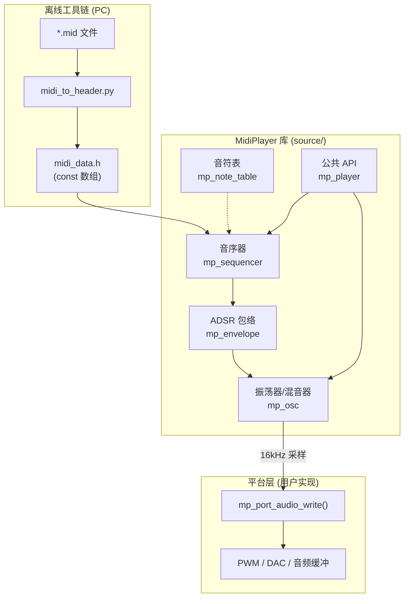
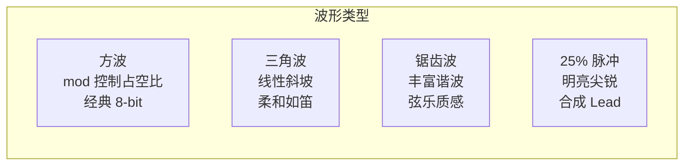
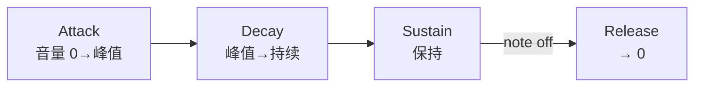

# MidiPlayer

跨平台轻量级 MIDI 方波混音库，纯 C 实现，零外部依赖。可作为 git submodule 集成到任意嵌入式或桌面项目中。

内置 STM32F103 示例，一条命令即可将任意 MIDI 文件转换并烧录到 MCU 播放。

## 特性

- **4 通道实时混音**：3 路旋律 + 1 路 LFSR 噪声，整数加法混合，10-bit PWM 输出
- **4 种波形**：方波（可变占空比）、三角波、锯齿波、25% 脉冲波
- **ADSR 包络**：7 种预设（钢琴、管风琴、弦乐、贝斯、Lead、Pad 等），线性四阶段音量调制
- **MIDI 乐器映射**：根据 General MIDI Program Number 自动选择波形 + 占空比 + ADSR
- **紧凑数据格式**：每个音符事件仅 8 字节（位域压缩），比朴素结构体节省 50%
- **跨平台**：库核心不依赖任何硬件 API，通过 `mp_port.h` 接口适配不同平台
- **单元测试**：52 个测试用例，支持 Host 编译 + ASan + lcov 覆盖率
- **GitHub CI**：单元测试、STM32 交叉编译、代码格式检查、MIDI 转换验证

## 架构



## 合成原理

### 方波合成

使用 16-bit 相位累加器 + 阈值比较生成方波，无需查表，无浮点运算：

```
phase_acc += phase_increment    // 每次 ISR 推进
sample = (phase_acc >> 8) < mod ? +vol : -vol
```

`phase_increment` 决定频率，`mod` 决定占空比，`vol` 决定音量。三者完全独立。

### 多波形



所有波形均为纯整数运算，在 16kHz ISR 中通过 `phase_hi`（相位高字节 0~255）直接计算。

### 混音数学

4 通道各自输出 ±vol（vol 为 0~127），混合后加 DC 偏移 512：

```
PWM = 512 + ch0 + ch1 + ch2 + noise
范围: 512 - 4×127 = 4  ~  512 + 4×127 = 1020
```

10-bit (0~1023) 范围内，永远不溢出。

### ADSR 包络



以 2kHz 频率运行（16kHz 采样 / 8 分频），线性插值调制振荡器音量。7 种预设覆盖常见乐器特征。

### 数据压缩

每个音符事件压缩为 2 × uint32_t = 8 字节：

```
Word0 [31:0]:  start_time_ms(20) | duration_ms(12)
Word1 [31:0]:  phase_inc(15) | volume(7) | channel(2) | mod_idx(3) | adsr(3) | waveform(2)
```

占空比使用 3-bit 索引查表（8 种预设值），ADSR 和波形各用 2~3 bit。

## 快速开始

### 环境准备

```bash
# Python 依赖（MIDI 转换）
pip install mido

# ARM 工具链（STM32 编译）
sudo apt install gcc-arm-none-eabi

# 烧录工具（二选一）
sudo apt install stlink-tools    # ST-Link
sudo apt install openocd         # DAPLink
```

### 一键播放 MIDI

```bash
# 转换 + 编译 + 烧录，一条命令
tools/load_midi.sh your_song.mid

# 指定音轨数和调试器类型
tools/load_midi.sh your_song.mid -t 5 -p stlink

# 只编译不烧录
tools/load_midi.sh your_song.mid -n
```

### 运行单元测试

```bash
# 编译并运行
cd tests && ./run_tests.sh

# 带覆盖率报告
./run_tests.sh coverage --threshold 80
```

### STM32 手动编译

```bash
cd examples/stm32f103
mkdir build && cd build
cmake -DCMAKE_TOOLCHAIN_FILE=../../../cmake/arm-none-eabi-gcc.cmake ..
make -j$(nproc)

# 烧录
../../../tools/flash.sh -p daplink -r MidiPlayer_STM32.hex
```

## 硬件连接

STM32F103 示例使用 PA0 (TIM2_CH1) 输出 ~70kHz PWM，外接 RC 低通滤波器：

```
PA0 ─── R(1kΩ) ───┬─── 扬声器/耳机
                   │
                 C(10nF)
                   │
                  GND

截止频率 ≈ 15.9kHz，PWM 载波 ~70kHz，间距 >4 倍，一阶 RC 足够
```

串口调试：USART1 (PA9/PA10)，115200 波特率。

## 作为子仓库集成

```bash
git submodule add https://github.com/user/MidiPlayer.git libs/MidiPlayer
```

```cmake
# 你的 CMakeLists.txt
set(MP_OSC_CH_COUNT 4)  # 可选：配置通道数
include(libs/MidiPlayer/cmake/library.cmake)

target_sources(my_app PRIVATE ${MIDIPLAYER_SOURCES})
target_include_directories(my_app PRIVATE ${MIDIPLAYER_INCLUDES})
target_compile_definitions(my_app PRIVATE ${MIDIPLAYER_DEFINITIONS})
```

然后实现两个平台函数：

```c
#include "mp_port.h"

void mp_port_audio_write(uint16_t value) {
    // 写入 PWM 比较寄存器 / DAC / 音频缓冲区
    TIMx->CCRy = value;
}

uint32_t mp_port_get_tick_ms(void) {
    // 返回毫秒计数
    return HAL_GetTick();
}
```

应用代码：

```c
#include "mp_player.h"
#include "midi_data.h"  // 由 midi_to_header.py 生成

mp_init();
mp_play(&midi_score);

// 在 16kHz 定时器中断中：
void TIM_IRQHandler(void) {
    mp_port_audio_write(mp_audio_tick());
    static uint8_t pre = 8;
    if (--pre == 0) { pre = 8; mp_update(mp_port_get_tick_ms()); }
}
```

## 目录结构

```
MidiPlayer/
├── source/                 # 库核心（纯 C，零平台依赖）
│   ├── mp_osc.c/h          #   振荡器：方波/三角/锯齿/脉冲 + LFSR 噪声
│   ├── mp_envelope.c/h     #   ADSR 包络发生器
│   ├── mp_sequencer.c/h    #   事件驱动音序器（8 字节压缩格式）
│   ├── mp_note_table.c/h   #   MIDI 音符 → 相位增量查找表
│   ├── mp_player.c/h       #   公共 API
│   └── mp_port.h           #   平台接口定义
├── tests/                  # 单元测试（Host 编译，52 个用例）
├── examples/stm32f103/     # STM32F103 独立运行示例
├── scripts/
│   ├── midi_to_header.py   #   MIDI → C 头文件转换器
│   └── midi_player.py      #   PC 端验证播放器
├── tools/
│   ├── load_midi.sh        #   一键转换+编译+烧录
│   ├── flash.sh            #   固件烧录（ST-Link / DAPLink）
│   └── code_format.sh      #   代码格式化
├── cmake/
│   ├── library.cmake       #   子仓库集成入口
│   └── arm-none-eabi-gcc.cmake
├── resources/              #   MIDI 测试文件
└── docs/                   #   设计文档
```

## 资源占用（STM32F103 示例）

| 资源 | 用量 | 说明 |
|------|------|------|
| Flash (代码) | ~25 KB | 库 + 平台层 + ArduinoAPI |
| Flash (数据) | 按曲目 | 每音符 8 字节，Pirates 2 轨 ≈ 10 KB |
| RAM | ~5 KB | 通道状态 + 栈 + 堆 |
| CPU (ISR) | <3% | 16kHz × ~50 周期 / 72MHz |
| 定时器 | TIM2 + TIM3 | PWM 输出 + 采样中断 |

## 许可证

MIT License
