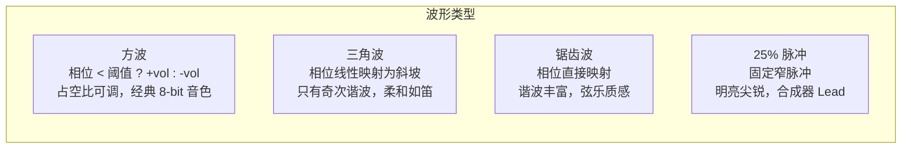
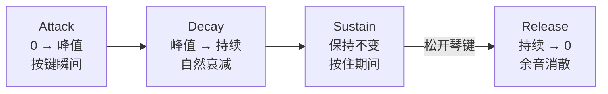
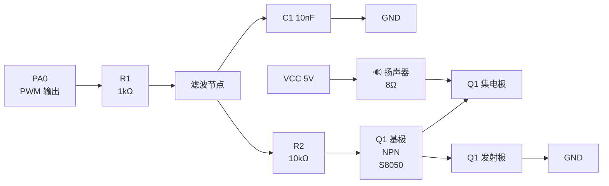

# MidiPlayer

跨平台轻量级 MIDI 方波混音库，纯 C 实现，零外部依赖。可作为 git submodule 集成到任意嵌入式或桌面项目中。

内置 STM32F103 示例，一条命令即可将任意 MIDI 文件转换并烧录到 MCU 播放。

## 特性

- **4 通道实时混音**：3 路旋律 + 1 路 LFSR 噪声，整数加法混合，10-bit PWM 输出
- **4 种波形**：方波（可变占空比）、三角波、锯齿波、25% 脉冲波
- **ADSR 包络**：7 种预设（钢琴、管风琴、弦乐、贝斯、Lead、Pad 等）
- **MIDI 乐器映射**：根据 General MIDI Program Number 自动选择波形 + 占空比 + ADSR
- **紧凑数据格式**：每个音符事件仅 8 字节（位域压缩），比朴素结构体节省 50%
- **回调式平台抽象**：通过 `mp_port_init()` 注册回调函数，无链接耦合，支持动态切换
- **单元测试**：52 个测试用例，支持 Host 编译 + ASan + lcov 覆盖率
- **GitHub CI**：单元测试、STM32 交叉编译、代码格式检查、MIDI 转换验证

## 架构


## 核心概念

### 相位累加器（Phase Accumulator）

这是所有波形生成的基础。一个 16-bit 计数器每次采样时加上一个固定值（`phase_increment`），加得越快，计数器翻转越频繁，输出频率越高：

```
phase_acc += phase_increment    // 每次 16kHz ISR 调用
频率 = phase_increment × 采样率 / 65536
```

例如 A4 (440Hz)：`phase_increment = 440 × 65536 / 16000 = 1802`

### 波形合成

取相位累加器的高 8 位（0~255）作为"相位"，不同波形用不同方式把相位映射为采样值：



所有波形均为纯整数运算，无查表、无浮点、无除法，在 16kHz 定时器中断中完成。

### 混音

4 个通道各自输出 ±vol（vol 为 0~127），直接整数相加，再加 DC 偏移 512：

```
PWM = 512 + ch0 + ch1 + ch2 + noise
范围: 512 - 4×127 = 4  ~  512 + 4×127 = 1020
```

10-bit (0~1023) 范围内永远不溢出，无需归一化或饱和处理。

### ADSR 包络（Envelope）

ADSR 是合成器中控制音量随时间变化的标准模型，四个阶段分别是：

- **A (Attack)**：按下琴键后，音量从 0 上升到峰值的时间。钢琴很快（几毫秒），弦乐很慢（几百毫秒）
- **D (Decay)**：到达峰值后，音量下降到持续水平的时间。钢琴有明显衰减，管风琴几乎没有
- **S (Sustain)**：持续按住琴键时保持的音量水平（占峰值的百分比）。管风琴 100%，钢琴约 30%
- **R (Release)**：松开琴键后，音量从持续水平降到 0 的时间。Pad 音色很长，打击乐很短



本库以 2kHz 频率运行包络（16kHz 采样 ÷ 8 分频），线性插值调制振荡器音量。内置 7 种预设：

| 预设 | Attack | Decay | Sustain | Release | 适用乐器 |
|------|--------|-------|---------|---------|----------|
| Piano | 2ms | 400ms | 31% | 200ms | 钢琴、吉他、木琴 |
| Organ | 1ms | 0 | 100% | 50ms | 管风琴、手风琴 |
| Strings | 100ms | 0 | 100% | 300ms | 小提琴、大提琴 |
| Bass | 3ms | 200ms | 63% | 100ms | 贝斯、低音提琴 |
| Lead | 4ms | 50ms | 86% | 75ms | 合成器主音 |
| Pad | 200ms | 0 | 100% | 500ms | 合成器铺底 |

### LFSR 噪声

第 4 通道使用 16-bit 线性反馈移位寄存器（LFSR）生成伪随机噪声。每次采样时移位一次，用第 15 和第 14 位异或作为反馈。输出的 MSB 决定正负极性，乘以音量即得噪声采样值。可用于打击乐和音效。

### 数据压缩

每个音符事件压缩为 2 × uint32_t = 8 字节：

```
Word0 [31:0]:  start_time_ms(20) | duration_ms(12)
Word1 [31:0]:  phase_inc(15) | volume(7) | channel(2) | mod_idx(3) | adsr(3) | waveform(2)
```

- 开始时间 20 位，覆盖 17 分钟
- 持续时间 12 位，最大 4095ms
- 占空比用 3-bit 索引查表（8 种预设值）
- ADSR 和波形各用 2~3 bit

### MIDI 乐器映射

转换器根据 MIDI Program Change 消息自动选择合成参数：

| MIDI 乐器族 | 波形 | ADSR | 说明 |
|-------------|------|------|------|
| 钢琴 (0-7) | 三角波 | Piano | 柔和的打击感 |
| 管风琴 (16-23) | 方波 50% | Organ | 持续的饱满音色 |
| 吉他 (24-31) | 锯齿波 | Piano | 拨弦的明亮衰减 |
| 贝斯 (32-39) | 方波 50% | Bass | 厚实的低频 |
| 弦乐 (40-55) | 锯齿波 | Strings | 缓慢的弓弦渐入 |
| 铜管 (56-63) | 锯齿波 | Lead | 有力的吹奏感 |
| 长笛 (72-79) | 三角波 | Organ | 纯净的管乐 |
| 合成 Lead (80-87) | 25% 脉冲 | Lead | 尖锐的电子音 |
| 合成 Pad (88-95) | 三角波 | Pad | 缓慢的氛围铺底 |

## 快速开始

### 环境准备

```bash
# Python 依赖（MIDI 转换）
pip install mido

# ARM 工具链（STM32 编译）
sudo apt install gcc-arm-none-eabi

# 烧录工具（二选一）
sudo apt install stlink-tools    # ST-Link
sudo apt install openocd         # DAPLink
```

### 一键播放 MIDI

```bash
# 转换 + 编译 + 烧录，一条命令
tools/load_midi.sh your_song.mid

# 指定音轨数和调试器类型
tools/load_midi.sh your_song.mid -t 5 -p stlink

# 只编译不烧录
tools/load_midi.sh your_song.mid -n
```

### 运行单元测试

```bash
# 编译并运行
cd tests && ./run_tests.sh

# 带覆盖率报告
./run_tests.sh coverage --threshold 80
```

### STM32 手动编译

```bash
cd examples/stm32f103
mkdir build && cd build
cmake -DCMAKE_TOOLCHAIN_FILE=../../../cmake/arm-none-eabi-gcc.cmake ..
make -j$(nproc)

# 烧录
../../../tools/flash.sh -p daplink -r MidiPlayer_STM32.hex
```

## 硬件连接

STM32F103 示例使用 PA0 (TIM2_CH1) 输出 ~70kHz PWM。GPIO 不能直驱扬声器，需要经过 RC 低通滤波 + 三极管放大：



**电路说明：**

| 元件 | 值 | 作用 |
|------|-----|------|
| R1 | 1kΩ | 与 C1 组成 RC 低通滤波器 |
| C1 | 10nF | 滤除 ~70kHz PWM 载波（截止频率 ≈ 15.9kHz） |
| R2 | 10kΩ | 限制三极管基极电流 |
| Q1 | S8050 NPN | 驱动扬声器（Ic 最大 500mA） |
| 扬声器 | 8Ω | 接在 VCC 和集电极之间 |

> 如果用无源蜂鸣器，可以省掉 R1+C1 滤波，直接 PWM 方波驱动（方波本身就是蜂鸣器需要的信号）。

串口调试：USART1 (PA9/PA10)，115200 波特率。

## 作为子仓库集成

### 1. 添加子仓库

```bash
git submodule add https://github.com/user/MidiPlayer.git libs/MidiPlayer
```

### 2. CMake 引入

```cmake
# 你的 CMakeLists.txt
set(MP_OSC_CH_COUNT 4)  # 可选：配置通道数
include(libs/MidiPlayer/cmake/library.cmake)

target_sources(my_app PRIVATE ${MIDIPLAYER_SOURCES})
target_include_directories(my_app PRIVATE ${MIDIPLAYER_INCLUDES})
target_compile_definitions(my_app PRIVATE ${MIDIPLAYER_DEFINITIONS})
```

### 3. 注册平台回调

```c
#include "mp_port.h"
#include "mp_player.h"
#include "midi_data.h"  // 由 midi_to_header.py 生成

// 实现两个回调函数
static void my_audio_write(uint16_t value) {
    TIMx->CCRy = value;  // 或 DAC 输出、音频缓冲区写入等
}

static uint32_t my_get_tick(void) {
    return HAL_GetTick();  // 或任何毫秒计数源
}

void app_init(void) {
    // 注册回调
    mp_port_t port = {
        .audio_write = my_audio_write,
        .get_tick_ms = my_get_tick,
    };
    mp_port_init(&port);

    // 初始化并播放
    mp_init();
    mp_play(&midi_score);
}

// 在 16kHz 定时器中断中调用：
void TIM_IRQHandler(void) {
    mp_port_audio_write(mp_audio_tick());
    static uint8_t pre = 8;
    if (--pre == 0) { pre = 8; mp_update(mp_port_get_tick_ms()); }
}
```

回调方式的好处：
- 库编译时不依赖任何平台头文件
- 运行时可以动态切换输出目标（比如从 PWM 切到 DAC）
- 测试时直接注册 mock 回调，无需条件编译

## 目录结构

```
MidiPlayer/
├── source/                 # 库核心（纯 C，零平台依赖）
│   ├── mp_osc.c/h          #   振荡器：方波/三角/锯齿/脉冲 + LFSR 噪声
│   ├── mp_envelope.c/h     #   ADSR 包络发生器（7 种预设）
│   ├── mp_sequencer.c/h    #   事件驱动音序器（8 字节压缩格式）
│   ├── mp_note_table.c/h   #   MIDI 音符 → 相位增量查找表
│   ├── mp_player.c/h       #   公共 API
│   ├── mp_port.c/h         #   平台回调接口
├── tests/                  # C 单元测试（Host 编译，56 个用例）
├── examples/stm32f103/     # STM32F103 独立运行示例
├── tools/
│   ├── player/             #   PC MIDI 播放器（Python 包，与 MCU 算法一致）
│   │   ├── oscillator.py   #     波形合成（方波/三角/锯齿/脉冲）
│   │   ├── envelope.py     #     ADSR 包络（7 种预设）
│   │   ├── mixer.py        #     4 通道混音
│   │   ├── sequencer.py    #     MIDI 事件音序器
│   │   └── instruments.py  #     GM 乐器映射
│   ├── tests/              #   Python 单元测试（40 个用例）
│   ├── midi_to_header.py   #   MIDI → C 头文件转换器
│   ├── load_midi.sh        #   一键转换+编译+烧录
│   ├── flash.sh            #   固件烧录（ST-Link / DAPLink）
│   ├── code_format.sh      #   C 代码格式化
│   └── python_format.sh    #   Python 格式化 + lint
├── cmake/
│   ├── library.cmake       #   子仓库集成入口
│   └── arm-none-eabi-gcc.cmake
├── resources/              #   MIDI 测试文件
└── docs/                   #   设计文档
```

## 资源占用（STM32F103 示例）

| 资源 | 用量 | 说明 |
|------|------|------|
| Flash (代码) | ~25 KB | 库 + 平台层 + ArduinoAPI |
| Flash (数据) | 按曲目 | 每音符 8 字节，Pirates 2 轨 ≈ 10 KB |
| RAM | ~5 KB | 通道状态 + 栈 + 堆 |
| CPU (ISR) | <3% | 16kHz × ~50 周期 / 72MHz |
| 定时器 | TIM2 + TIM3 | PWM 输出 + 采样中断 |

## 许可证

MIT License
