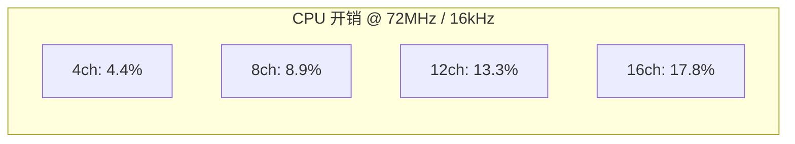

# 8 通道扩展方案

## 1. 现状

### 1.1 当前通道配置

- **MP_OSC_CH_COUNT = 4**：3 旋律 + 1 噪声
- 所有 MIDI track 的音符挤进 3 个旋律通道，碰撞严重
- 打包格式 `channel` 字段仅 2 bit（0~3）

### 1.2 资源文件并行度分析

| 文件 | 旋律轨 | 总音符 | 最大并行 | 打击 | 3ch 碰撞 | 7ch 碰撞 | 碰撞减少 |
|------|--------|--------|----------|------|----------|----------|----------|
| Apologize | 1 | 657 | 5 | N | 108 | **0** | -100% |
| Baby | 1 | 2532 | 11 | Y | 2671 | 2356 | -12% |
| BeatIt | 15 | 5009 | 15 | Y | 3437 | 2090 | -39% |
| HotelCalifornia | 5 | 7493 | 11 | Y | 5202 | 3572 | -31% |
| ItsMyLife | 1 | 2209 | 11 | Y | 1491 | 1057 | -29% |
| JamesBond | 14 | 1738 | 16 | Y | 1505 | 1188 | -21% |
| MoonlightSonata | 1 | 1143 | 6 | N | 183 | **0** | -100% |
| Pirates | 2 | 1255 | 5 | N | 563 | 563 | 0% |
| PokerFace | 1 | 3461 | 9 | Y | 1710 | 1030 | -40% |
| Smile.dkButterfly | 13 | 7843 | 18 | Y | 6725 | 5408 | -20% |
| WeWillRockYou | 9 | 770 | 9 | Y | 262 | 293 | +12% |
| YMCA | 12 | 5233 | 19 | Y | 5027 | 4518 | -10% |

**结论：**
- 并行度 ≤ 7 的曲目（Apologize、MoonlightSonata）可以做到 **零碰撞**
- 大部分曲目碰撞减少 **20~40%**
- 最大并行度 19（YMCA），即使 7 通道也无法完全消除碰撞，但大幅改善

### 1.3 MCU 资源评估



| 通道数 | 旋律 + 噪声 | CPU 占用 | RAM 增量 |
|--------|-------------|---------|---------|
| 4 (当前) | 3 + 1 | 4.4% | 基准 |
| **8 (目标)** | **7 + 1** | **8.9%** | **+~40 bytes** |
| 12 | 11 + 1 | 13.3% | +~80 bytes |
| 16 | 15 + 1 | 17.8% | +~120 bytes |

8 通道 CPU 仅 8.9%，RAM 增量约 40 bytes（4 个 `mp_osc_params` × 10 bytes），完全可行。

## 2. 打包格式变更

### 2.1 Word1 位域重排

`mod_idx` 从 3 bit 缩减到 2 bit（实际只用了 3 种占空比值），腾出 1 bit 给 `channel`。

```
当前 Word1 [31:0]:
  phase_inc  [14:0]  — 15 bits
  volume     [21:15] —  7 bits
  channel    [23:22] —  2 bits (0~3)   ← 不够
  mod_idx    [26:24] —  3 bits (0~7)
  adsr       [29:27] —  3 bits (0~7)
  waveform   [31:30] —  2 bits (0~3)
  总计: 32 bits

新 Word1 [31:0]:
  phase_inc  [14:0]  — 15 bits (不变)
  volume     [21:15] —  7 bits (不变)
  channel    [24:22] —  3 bits (0~7)   ← 扩展
  mod_idx    [26:25] —  2 bits (0~3)   ← 缩减
  adsr       [29:27] —  3 bits (0~7)   (不变)
  waveform   [31:30] —  2 bits (0~3)   (不变)
  总计: 32 bits ✓
```

### 2.2 mod_idx 查表缩减

当前 8 项查表，实际只用 3 种值：

| 旧 idx | 值 | 占空比 | 使用情况 |
|--------|-----|--------|---------|
| 0 | 127 | 50% | ✅ 大量使用 |
| 1 | 64 | 25% | ✅ 使用 |
| 2 | 32 | 12.5% | ✅ 使用 |
| 3 | 191 | 75% | ❌ 未使用 |
| 4~7 | ... | ... | ❌ 未使用 |

缩减为 4 项（2 bit）：

| 新 idx | 值 | 占空比 |
|--------|-----|--------|
| 0 | 127 | 50% |
| 1 | 64 | 25% |
| 2 | 32 | 12.5% |
| 3 | 191 | 75% (保留) |

## 3. 混音溢出处理

### 3.1 问题

每通道输出 ±127，8 通道最大 `512 ± 8×127 = 512 ± 1016`：
- 最小值: 512 - 1016 = **-504** → clamp 到 0
- 最大值: 512 + 1016 = **1528** → clamp 到 1023

理论上可能溢出，但实际中不太可能所有 8 通道同时满音量。

### 3.2 方案对比

| 方案 | 做法 | 优点 | 缺点 |
|------|------|------|------|
| **A: 保持 clamp** | 不改混音，靠 clamp | 零改动 | 极端情况削波 |
| B: 缩放音量 | `vol = vol * 4 / CH_COUNT` | 不溢出 | 音量变小，精度损失 |
| C: 动态压缩 | 检测溢出时衰减 | 自适应 | 复杂，ISR 开销 |

**推荐方案 A**：保持 clamp。实际 MIDI 中很少有 8 个通道同时满音量，偶尔的 clamp 听感上几乎无影响。如果后续发现问题再加方案 B。

## 4. 改动清单

### 4.1 C 库 (source/)

| 文件 | 改动 |
|------|------|
| `mp_osc.h` | `MP_OSC_CH_COUNT` 默认值 4 → 8 |
| `mp_sequencer.h` | Word1 位域重排，`mp_mod_table` 缩减为 4 项，更新 accessor 宏 |
| `mp_sequencer.c` | 无改动（通过宏自动适配） |
| `mp_osc.c` | 无改动（通过 `MP_OSC_CH_COUNT` 自动适配） |
| `mp_envelope.c/h` | 无改动（通过 `MP_OSC_CH_COUNT` 自动适配） |

### 4.2 工具链 (tools/)

| 文件 | 改动 |
|------|------|
| `midi_to_header.py` | `MOD_TO_IDX` 映射更新，`pack_word1` 位域更新，`assign_channels` 用 7 旋律通道 |
| `player/sequencer.py` | `NUM_MELODIC` 自动跟随 `NUM_CHANNELS`，通道分配用 7 通道 |
| `player/mixer.py` | `NUM_CHANNELS` 改为 8 |
| `player/oscillator.py` | 无改动 |
| `player/visualizer.py` | 自动适配（已用 `NUM_CHANNELS` 常量） |

### 4.3 测试

| 文件 | 改动 |
|------|------|
| `tests/test_sequencer.c` | 更新 `MP_EVT_PACK_WORD1` 调用（mod_idx 范围 0~3） |
| `tests/test_player.c` | 同上 |
| `tools/tests/test_sequencer.py` | 通道分配测试适配 7 旋律通道 |
| `tools/tests/test_mixer.py` | 混音测试适配 8 通道 |

### 4.4 文档 / 配置

| 文件 | 改动 |
|------|------|
| `README.md` | 特性描述 4→8 通道，混音公式更新 |
| `cmake/library.cmake` | 默认 `MP_OSC_CH_COUNT` 说明更新 |
| `examples/stm32f103/` | 无改动（通过宏自动适配） |

## 5. 实施步骤

1. **Phase 1**：C 库位域重排 + `MP_OSC_CH_COUNT=8` + C 测试更新
2. **Phase 2**：`midi_to_header.py` 打包格式同步 + Python player 通道数更新
3. **Phase 3**：Python 测试更新 + 全量测试
4. **Phase 4**：README 更新
