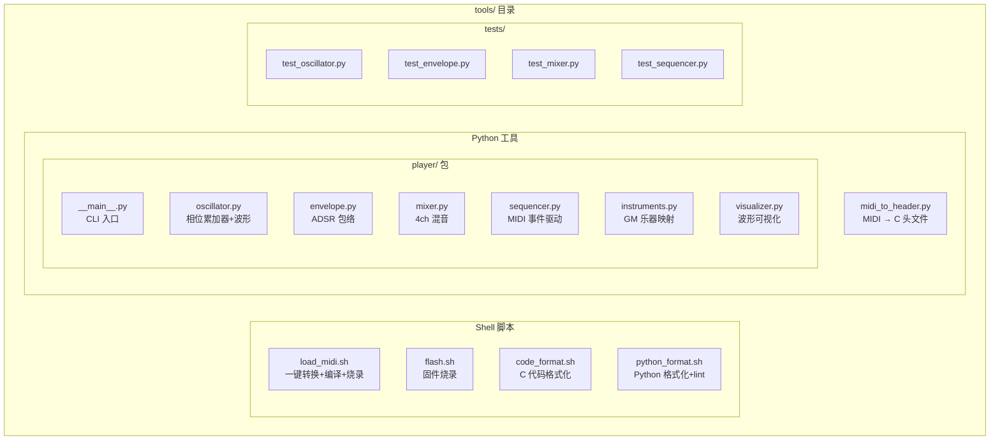
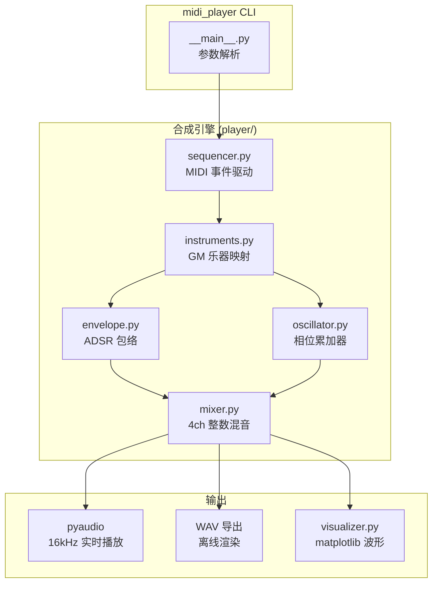
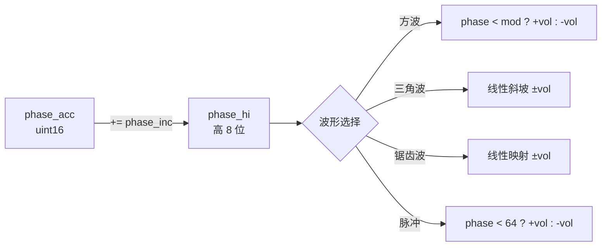
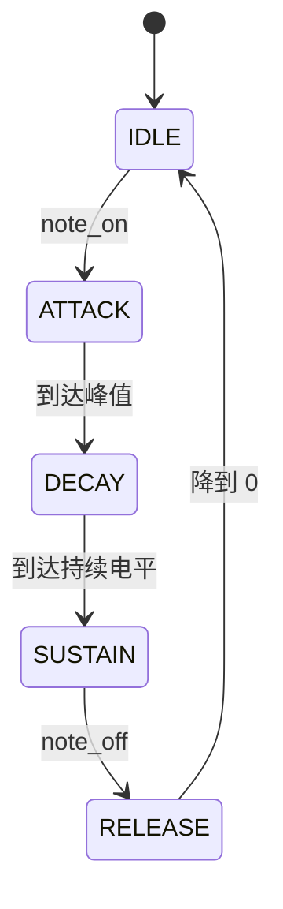
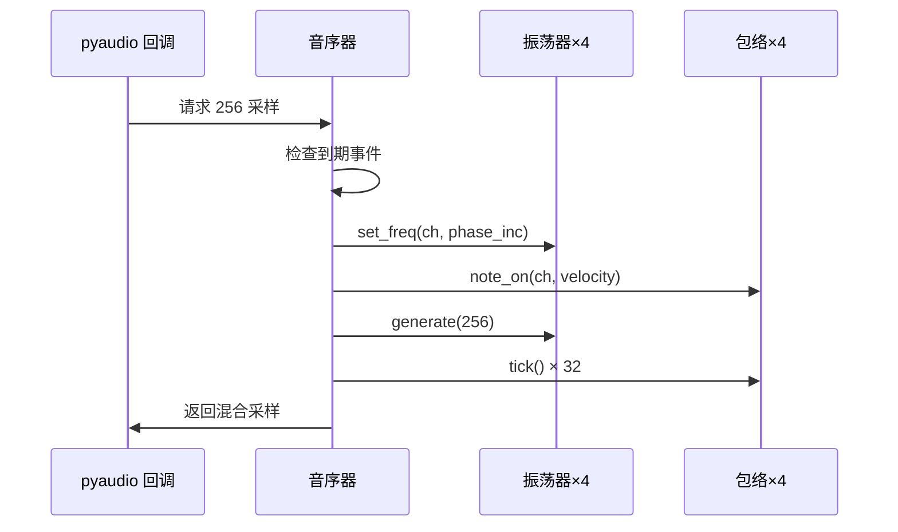
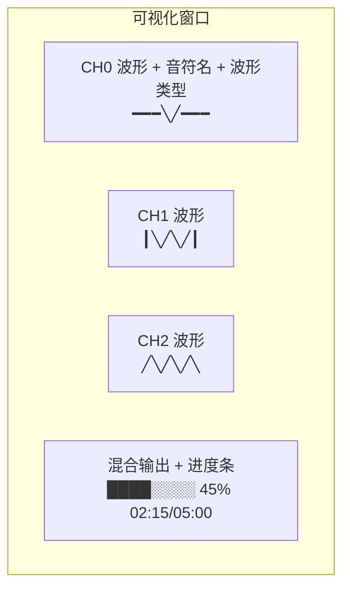

# PC MIDI Player — 设计方案

## 1. 目标

将 `scripts/midi_player.py` 重写为功能完整的 PC 端 MIDI 播放器，使用与 MCU 版本**完全相同的合成算法**，并增加实时波形可视化。同时合并 `scripts/` 和 `tools/` 目录，统一工具链管理。

## 2. 性能分析

**结论：Python + numpy 完全够用。**

| 方式 | 1 秒音频耗时 | 实时倍率 |
|------|-------------|---------|
| numpy 向量化（推荐） | 0.2 ms | 4600× |
| 纯 Python 逐采样 | 30 ms | 33× |
| 实时要求 | 1000 ms | 1× |

numpy 向量化方案比实时快 4600 倍，即使加上 ADSR 包络和可视化开销，也有几百倍余量。pyaudio 回调以 256 采样（16ms）为单位，每次回调只需 ~0.01ms 计算。

## 3. 目录结构重组

合并 `scripts/` 和 `tools/` 为统一的 `tools/` 目录：



迁移后的目录：

```
tools/
├── load_midi.sh                # 一键转换+编译+烧录
├── flash.sh                    # 固件烧录
├── code_format.sh              # C/C++ 格式化
├── python_format.sh            # Python black + flake8
├── midi_to_header.py           # MIDI → C 头文件转换器
├── player/                     # PC MIDI 播放器（Python 包）
│   ├── __init__.py
│   ├── __main__.py             # CLI 入口 (python -m tools.player song.mid)
│   ├── oscillator.py           # 波形合成（移植自 mp_osc.c）
│   ├── envelope.py             # ADSR 包络（移植自 mp_envelope.c）
│   ├── mixer.py                # 4 通道混音
│   ├── sequencer.py            # MIDI 事件音序器
│   ├── instruments.py          # GM 乐器 → 合成参数映射
│   └── visualizer.py           # matplotlib 实时波形
├── tests/                      # Python 单元测试
│   ├── __init__.py
│   ├── test_oscillator.py
│   ├── test_envelope.py
│   ├── test_mixer.py
│   ├── test_sequencer.py
│   └── run_tests.py            # pytest 入口 + 覆盖率
└── requirements.txt            # Python 依赖
```

## 4. 架构



## 5. 模块设计

### 5.1 oscillator.py — 波形合成

移植自 `source/mp_osc.c`，使用 numpy 向量化：



关键：**用 numpy 数组一次生成整个 chunk（256 采样），而不是逐采样循环**。

### 5.2 envelope.py — ADSR 包络

移植自 `source/mp_envelope.c`，相同的 7 种预设、相同的线性插值逻辑：



tick 频率 = 2kHz（每 8 个采样调用一次），与 MCU 的 prescaler 一致。

### 5.3 mixer.py — 混音

```python
# 与 MCU 完全相同的混音公式
mix = 512 + ch0_samples + ch1_samples + ch2_samples + noise_samples
output = np.clip(mix, 0, 1023)
# 归一化到 float32 给 pyaudio
audio_out = (output.astype(np.float32) - 512) / 512
```

### 5.4 sequencer.py — 音序器

预解析 MIDI 文件为事件列表，在 pyaudio 回调中按时间戳触发：



### 5.5 visualizer.py — 波形可视化

使用 matplotlib FuncAnimation，4 个子图实时更新：



每个通道显示：最近 2 个周期的波形、当前音符、ADSR 阶段（A/D/S/R 高亮）。

## 6. 与 MCU 的对应关系

| MCU (C) | PC (Python) | 数值一致性 |
|---------|-------------|-----------|
| `mp_osc.c` | `oscillator.py` | ✅ 相同相位累加 + 波形算法 |
| `mp_envelope.c` | `envelope.py` | ✅ 相同预设参数和状态机 |
| `mp_sequencer.c` | `sequencer.py` | ✅ 相同事件驱动逻辑 |
| `mp_note_table.c` | `oscillator.py` | ✅ 相同 phase_inc 公式 |
| `midi_to_header.py` | `instruments.py` | ✅ 复用乐器映射表 |
| 16kHz TIM3 ISR | pyaudio 16kHz 回调 | ✅ 相同采样率 |
| 无 | `visualizer.py` | PC 独有 |

## 7. 测试策略

使用 **pytest** + **coverage** + **black** + **flake8**，参考 FPBInject WebServer 的模式：

| 模块 | 测试内容 |
|------|---------|
| `test_oscillator.py` | 各波形输出范围、频率正确性、占空比、静音 |
| `test_envelope.py` | ADSR 四阶段、预设参数、边界值 |
| `test_mixer.py` | 多通道混音、DC 偏移、不溢出 |
| `test_sequencer.py` | 事件触发时序、note on/off、进度查询 |

```bash
# 运行测试
cd tools && python -m pytest tests/ -v --cov=player --cov-report=html

# 格式化 + lint
tools/python_format.sh          # black + flake8
tools/python_format.sh --check  # CI 检查模式
```

## 8. CI 集成

在 `.github/workflows/ci.yml` 中新增 Python 测试 job：

```yaml
python-tests:
  runs-on: ubuntu-latest
  steps:
    - uses: actions/checkout@v4
    - uses: actions/setup-python@v5
      with: { python-version: '3.11' }
    - run: pip install -r tools/requirements-dev.txt
    - run: tools/python_format.sh --check --lint
    - run: cd tools && python -m pytest tests/ -v --cov=player
```

## 9. CLI 接口

```bash
# 基本播放
python -m tools.player song.mid

# 指定最大音轨数
python -m tools.player song.mid -t 3

# 播放 + 波形可视化
python -m tools.player song.mid --vis

# 导出 WAV（离线渲染，不需要 pyaudio）
python -m tools.player song.mid -o output.wav

# 静音模式（仅可视化）
python -m tools.player song.mid --vis --mute
```

## 10. 依赖

```
# tools/requirements.txt — 运行依赖
mido            # MIDI 文件解析
numpy           # 向量化合成
pyaudio         # 音频输出（需要 portaudio19-dev）
matplotlib      # 波形可视化
```

```
# tools/requirements-dev.txt — 开发/CI 依赖
-r requirements.txt
pytest          # 单元测试
coverage        # 覆盖率
black           # 代码格式化
flake8          # lint
```

## 11. 实施步骤

1. **Phase 0**：合并 `scripts/` → `tools/`，迁移现有文件，更新所有引用
2. **Phase 1**：合成引擎核心 — oscillator + envelope + mixer + 单元测试
3. **Phase 2**：音序器 + pyaudio 播放，能听到与 MCU 一致的声音
4. **Phase 3**：乐器映射 + WAV 导出
5. **Phase 4**：matplotlib 实时波形可视化
6. **Phase 5**：python_format.sh + CI 集成
