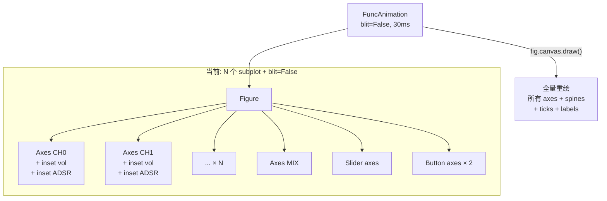
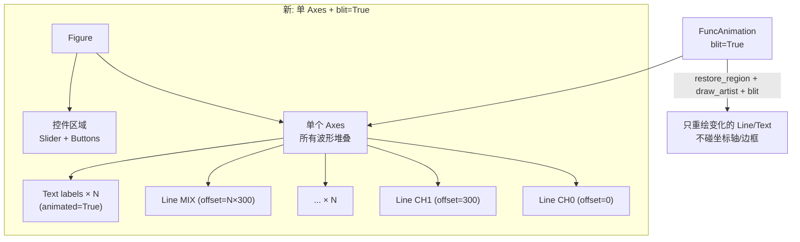

# Visualizer 性能优化方案

## 1. 现状性能数据

### 1.1 当前架构



### 1.2 性能瓶颈

| 通道数 | 子图数 | blit=False ms/帧 | FPS | 达标(33fps) |
|--------|--------|------------------|-----|-------------|
| 2 | 3 | 35 | 29 | ✗ |
| 4 | 5 | 45 | 22 | ✗ |
| 8 | 9 | 84 | 12 | ✗ |
| 14 | 15 | 134 | 7 | ✗ |
| 16 | 17 | 191 | 5 | ✗ |

**根因：`blit=False` 每帧重绘整个 Figure**，包括所有 axes 的坐标轴、刻度、边框、标签。子图越多，重绘面积越大。

### 1.3 各方案性能对比

| 方案 | 4ch | 8ch | 14ch | 16ch | 20ch |
|------|-----|-----|------|------|------|
| **当前 (N subplot, blit=False)** | 22fps | 12fps | 7fps | 5fps | — |
| N subplot, blit=True | 58fps | 44fps | 25fps | 24fps | — |
| **单 axes 堆叠, blit=True** | **98fps** | **71fps** | **49fps** | **46fps** | **40fps** |

## 2. 推荐方案：单 Axes 堆叠 + blit=True

### 2.1 核心思路

把所有波形画在**一个 Axes** 里，通过 Y 轴偏移垂直堆叠。只有一个 axes 需要 blit，性能提升 5~10 倍。



### 2.2 布局设计

```
Y 轴
  ↑
  │  ┌─────────────────────────────────────────┐
  │  │ MIX 波形                          [75%] │  offset = N × spacing
  │  ├─────────────────────────────────────────┤
  │  │ NOISE 波形              LFSR [Atk] ▮▮░  │  offset = (N-1) × spacing
  │  ├─────────────────────────────────────────┤
  │  │ ...                                     │
  │  ├─────────────────────────────────────────┤
  │  │ CH1 波形        C4 TRI [Sus] ▮▮▮░       │  offset = 1 × spacing
  │  ├─────────────────────────────────────────┤
  │  │ CH0 波形        A4 SQR [Atk] ▮▮▮▮░      │  offset = 0
  │  └─────────────────────────────────────────┘
  └──────────────────────────────────────────────→ X (samples)
       [⏸] [1.0×]  ═══════●══════  2:15 / 5:00
```

- 每个通道占 `spacing` 像素高度（如 300）
- 波形数据 + offset：`line.set_ydata(samples + i * spacing)`
- 通道标签用 `ax.text()` 放在右侧，`animated=True`
- 分隔线用 `ax.axhline()` 静态绘制（不参与 blit）

### 2.3 控件兼容

Slider 和 Button 放在独立的 axes 里（`fig.add_axes()`），不参与 blit。
用 `fig.canvas.mpl_connect` 手动触发控件区域的 `draw_idle()`。

```python
# 波形区域用 blit
def animate(frame):
    fig.canvas.restore_region(bg)
    for line, txt in zip(lines, texts):
        ax.draw_artist(line)
        ax.draw_artist(txt)
    fig.canvas.blit(ax.bbox)

# 控件区域用 draw_idle（低频更新）
def update_slider():
    slider.set_val(pct)  # 触发 draw_idle
```

### 2.4 通道信息面板

Rectangle 音量条和 ADSR 条**保留**，放在同一个 Axes 里用 `animated=True`，blit 开销极小（+4ms）：

```python
# 音量条：Rectangle 在波形右侧
vol_rect = Rectangle((520, offset - 20), 0, 40,
                      facecolor="#4CAF50", animated=True)
ax.add_patch(vol_rect)

# ADSR 阶段：4 个 Rectangle 并排
for j in range(4):
    adsr_rect = Rectangle((560 + j*12, offset - 15), 10, 30,
                           facecolor="#2a2a4a", animated=True)
    ax.add_patch(adsr_rect)

# 动画中更新：
vol_rect.set_width(env.level * 40 / 127)
adsr_rects[stage].set_facecolor(ACTIVE_COLOR)
ax.draw_artist(vol_rect)
```

实测性能（含 Rectangle bars）：

| 通道数 | ms/帧 | FPS |
|--------|-------|-----|
| 8 | 16 | 62 |
| 14 | 23 | 43 |
| 16 | 26 | 38 |

## 3. 实施步骤

### Phase 1：单 Axes 重构
- 所有波形画在一个 Axes 里，Y 偏移堆叠
- 静态分隔线 `axhline`
- 通道标签用 `text(animated=True)`
- 切换到 `blit=True`

### Phase 2：控件分离
- Slider / Button 放在独立 axes
- 波形 blit 和控件 draw_idle 分离
- 键盘快捷键不变

### Phase 3：信息面板
- Rectangle 音量条 + ADSR 条保留，放在主 Axes 里
- 全部设 `animated=True`，参与 blit
- 去掉所有 inset_axes（改为主 Axes 内的 Rectangle）

## 4. 预期效果

| 通道数 | 当前 FPS | 优化后 FPS | 提升 |
|--------|---------|-----------|------|
| 4 | 22 | ~98 | 4.5× |
| 8 | 12 | ~62 | 5× |
| 14 | 7 | ~43 | 6× |
| 16 | 5 | ~38 | 7.6× |
| 20 | — | ~32 | ∞ |

所有通道数都能达到 33fps 目标（含 Rectangle bars），16 通道仍有 38fps。
