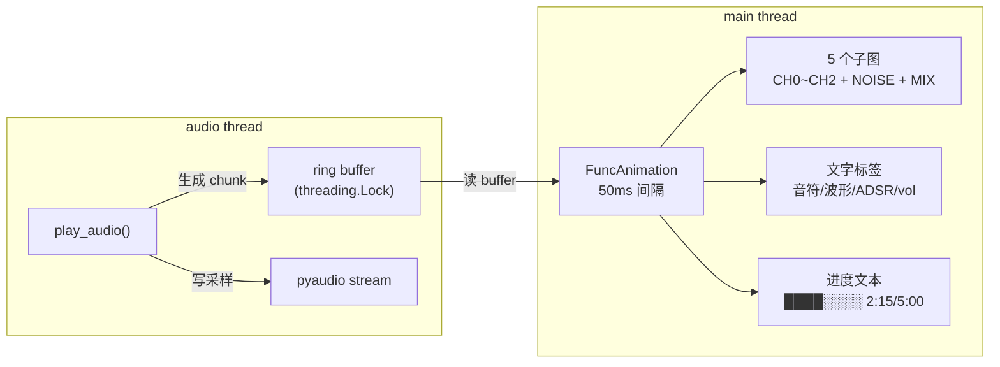
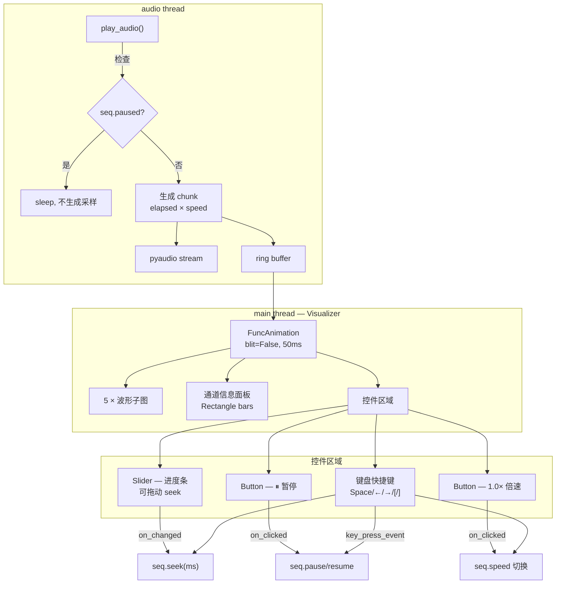
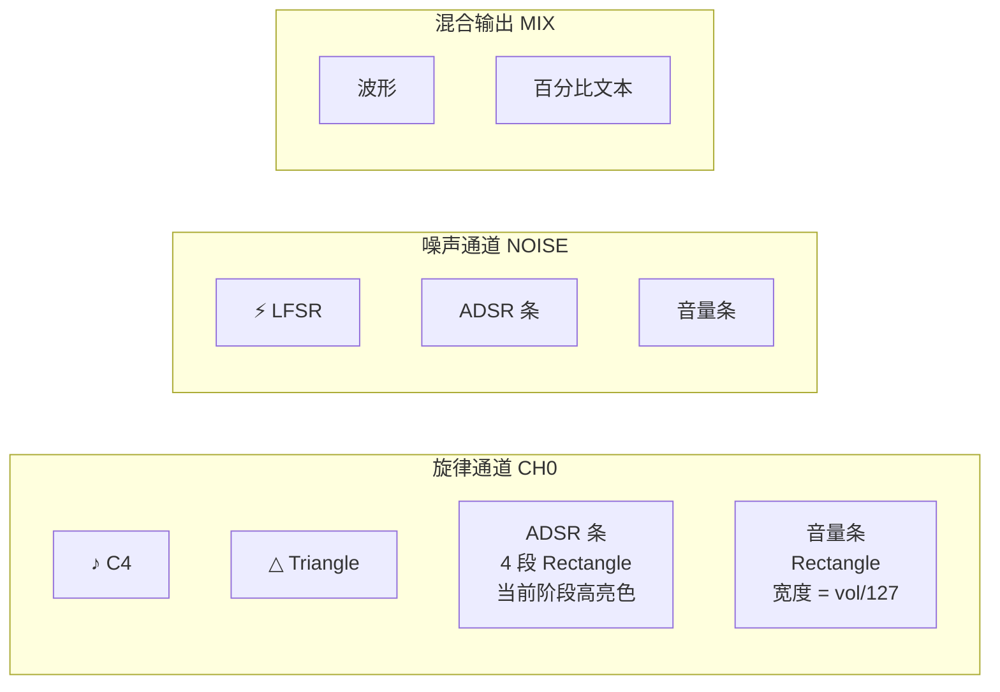
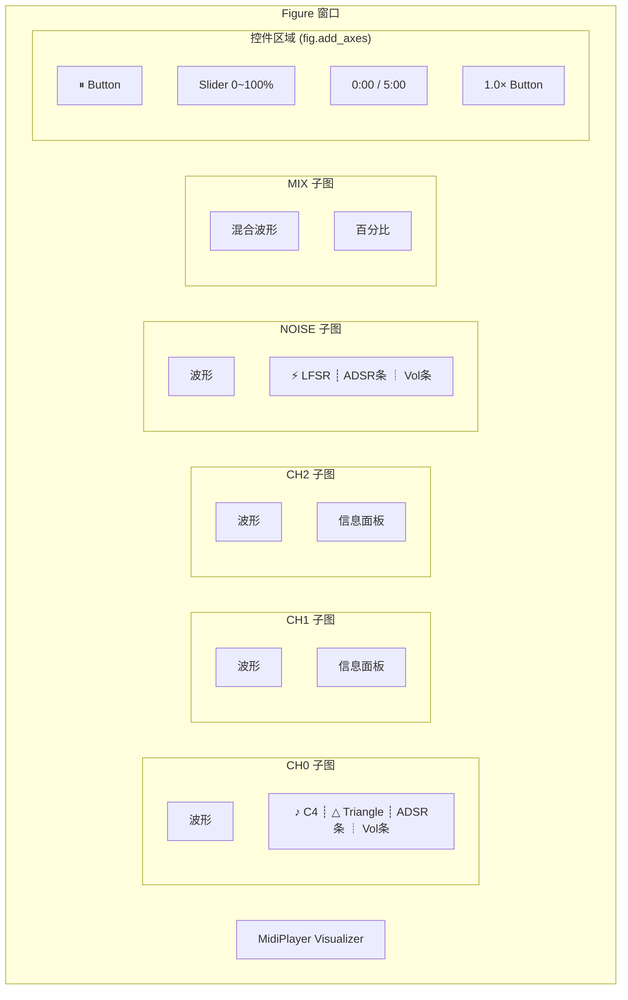

# PC MIDI Player 可视化整改方案

## 1. 现状分析

### 1.1 当前架构



### 1.2 现有问题

| 问题 | 严重程度 | 说明 |
|------|---------|------|
| **进度条不可交互** | 高 | 纯文本 `████░░░░`，不能拖动跳转 |
| **无暂停/恢复** | 高 | 没有任何播放控制，只能 Ctrl+C 退出 |
| **无倍速控制** | 中 | 无法加速/减速播放 |
| **音量显示不直观** | 中 | `vol=80` 纯数字，没有可视化条 |
| **ADSR 阶段显示简陋** | 低 | `[ATK]` 纯文本缩写，不够音乐化 |
| **无 seek 支持** | 高 | Sequencer 没有 seek 方法，只能从头播放 |

### 1.3 Sequencer 限制

当前 `Sequencer` 不支持 seek：
- `track_indices` 只能前进，不能回退
- `start_ms` 在第一次调用时锁定，无法重置
- `channel_off_times` 没有清理机制
- 没有 `pause()` / `resume()` / `seek()` 方法

## 2. 整改目标

### 2.1 目标架构



### 2.2 播放控制

| 功能 | 交互方式 | 说明 |
|------|---------|------|
| **暂停/恢复** | `Space` 键 / `Button` | 暂停音频输出和时间推进 |
| **进度拖动** | `matplotlib.widgets.Slider` | 拖动跳转到任意位置 |
| **倍速** | `[` / `]` 键 / `Button` | 0.5× / 1× / 1.5× / 2× 循环 |
| **快进/快退** | `←` / `→` 键 | ±5 秒跳转 |
| **重置** | `R` 键 | 回到开头 |

### 2.3 通道信息显示

每个通道子图内嵌图形化信息面板，使用 `matplotlib.patches.Rectangle` 绘制：



## 3. 技术方案

### 3.1 图形化组件选型

| 需求 | 组件 | 说明 |
|------|------|------|
| **进度条** | `matplotlib.widgets.Slider` | 原生支持拖动、`on_changed` 回调 |
| **暂停/倍速按钮** | `matplotlib.widgets.Button` | 原生支持点击、`on_clicked` 回调 |
| **音量条** | `matplotlib.patches.Rectangle` | 动态修改 `set_width()`，嵌入子图 |
| **ADSR 阶段条** | 4 个 `Rectangle` 并排 | 当前阶段亮色，其余暗色，`set_facecolor()` 切换 |
| **波形类型/音符** | `ax.text()` | 文本足够，配合 Unicode 音乐符号 |

不需要文本手搓 bar，`Rectangle` patch 是真正的图形元素，可以精确控制位置、宽度、颜色，且支持动画更新。

### 3.2 音量条实现

```python
# 创建时：在子图内嵌一个小 axes 作为音量条容器
ax_vol = ax.inset_axes([0.85, 0.7, 0.12, 0.08])  # [x, y, w, h] 相对子图
ax_vol.set_xlim(0, 127)
ax_vol.axis('off')

# 背景条（暗色）
bg = Rectangle((0, 0), 127, 1, facecolor='#1a1a2e')
ax_vol.add_patch(bg)

# 前景条（亮色，宽度动态更新）
vol_bar = Rectangle((0, 0), 0, 1, facecolor='#4CAF50')
ax_vol.add_patch(vol_bar)

# 动画中更新：
vol_bar.set_width(env.level)  # 0~127
```

### 3.3 ADSR 阶段条实现

4 个等宽 `Rectangle` 并排，颜色表示状态：

```python
ADSR_COLORS = {
    'active':   ['#2196F3', '#FF9800', '#4CAF50', '#F44336'],  # A/D/S/R 亮色
    'inactive': '#1a1a2e',  # 暗色
}

# 创建 4 个 Rectangle
adsr_bars = []
for j in range(4):
    rect = Rectangle((j * 0.25, 0), 0.23, 1, facecolor='#1a1a2e')
    ax_adsr.add_patch(rect)
    adsr_bars.append(rect)

# 动画中更新：根据 env.stage 高亮对应段
for j, rect in enumerate(adsr_bars):
    if j == int(env.stage) - 1:  # stage 1~4 对应 A/D/S/R
        rect.set_facecolor(ADSR_COLORS['active'][j])
    else:
        rect.set_facecolor(ADSR_COLORS['inactive'])
```

### 3.4 Sequencer 扩展

```python
class Sequencer:
    # 新增属性
    paused: bool = False
    speed: float = 1.0
    _pause_elapsed_ms: int = 0  # 暂停时记录的 elapsed

    def pause(self):
        """暂停播放"""
        self.paused = True
        self._pause_elapsed_ms = self.elapsed_ms

    def resume(self):
        """恢复播放，补偿暂停时间差"""
        self.paused = False
        # 重新对齐 start_ms 使 elapsed 连续
        # 由外部 play_audio 调整 wall-clock 基准

    def seek(self, target_ms):
        """跳转到指定时间点"""
        target_ms = max(0, min(target_ms, self.total_ms))

        # 二分查找定位每个 track 的 index
        for t, trk in enumerate(self.tracks):
            lo, hi = 0, len(trk)
            while lo < hi:
                mid = (lo + hi) // 2
                if trk[mid].start_ms <= target_ms:
                    lo = mid + 1
                else:
                    hi = mid
            self.track_indices[t] = lo

        # 清空通道状态
        self.channel_off_times.clear()
        for osc in self.oscillators:
            osc.silence()
        self.noise.silence()
        for env in self.envelopes:
            env.__init__()

        # 对齐时间
        self.elapsed_ms = target_ms
        self.playing = True
```

### 3.5 倍速实现

倍速在 `play_audio()` 外部通过缩放 wall-clock 时间实现，Sequencer 内部不感知：

```python
# play_audio() 中：
wall_elapsed_s = time.time() - start_time
current_ms = int(wall_elapsed_s * seq.speed * 1000) + seek_offset_ms
```

### 3.6 blit 策略

添加 `Slider` / `Button` 后必须关闭 `blit`：

| 方案 | blit | 优点 | 缺点 |
|------|------|------|------|
| **A: blit=False** | 关 | 简单，控件原生工作 | 每帧全量重绘 |
| B: 混合模式 | 开 | 波形高性能 | 控件需手动管理 |

**选方案 A**。50ms 间隔 × 5 个子图，matplotlib 开销约 5~10ms，远低于帧间隔，性能无问题。

### 3.7 键盘快捷键

```python
def on_key(event):
    if event.key == ' ':        # 暂停/恢复
        seq.pause() if not seq.paused else seq.resume()
    elif event.key == 'right':  # 前进 5s
        seq.seek(seq.elapsed_ms + 5000)
    elif event.key == 'left':   # 后退 5s
        seq.seek(seq.elapsed_ms - 5000)
    elif event.key == ']':      # 加速
        seq.speed = min(seq.speed + 0.5, 4.0)
    elif event.key == '[':      # 减速
        seq.speed = max(seq.speed - 0.5, 0.25)
    elif event.key == 'r':      # 重置
        seq.seek(0)

fig.canvas.mpl_connect('key_press_event', on_key)
```

## 4. 窗口布局



控件区域用 `fig.add_axes()` 在底部独立创建，不占用子图空间。

## 5. 波形符号与 ADSR 颜色

### 波形符号

| 波形 | 符号 | 显示文本 |
|------|------|---------|
| Square | `□` | `□ Square` |
| Triangle | `△` | `△ Triangle` |
| Sawtooth | `⊿` | `⊿ Sawtooth` |
| Pulse25 | `⌇` | `⌇ Pulse25` |

### ADSR 阶段颜色

| 阶段 | 激活色 | 含义 |
|------|--------|------|
| Attack | `#2196F3` (蓝) | 起音 |
| Decay | `#FF9800` (橙) | 衰减 |
| Sustain | `#4CAF50` (绿) | 持续 |
| Release | `#F44336` (红) | 释放 |
| Idle | `#1a1a2e` (暗) | 静默 |

## 6. 实施步骤

### Phase 1：Sequencer 播放控制
- 新增 `pause()` / `resume()` / `seek()` / `speed` 属性
- `seek()` 用二分查找定位 + 通道状态重置
- `__main__.py` 中 `play_audio()` 支持暂停和倍速时间缩放
- 补充单元测试

### Phase 2：UI 控件 + 交互
- `matplotlib.widgets.Slider` 进度条（可拖动 seek）
- `matplotlib.widgets.Button` 暂停/播放 + 倍速
- 键盘快捷键绑定（Space / ← → / [ ] / R）
- 切换到 `blit=False`

### Phase 3：通道信息图形化
- `Rectangle` 音量条（宽度 = vol/127）
- 4 × `Rectangle` ADSR 阶段条（当前阶段高亮）
- 波形 Unicode 符号（□ △ ⊿ ⌇）
- 音符名 + 音乐符号（♪）

### Phase 4：布局打磨
- 控件区域 `fig.add_axes()` 独立布局
- 时间文本 `0:00 / 5:00` 跟随 Slider
- 深色主题统一
- 窗口缩放响应
